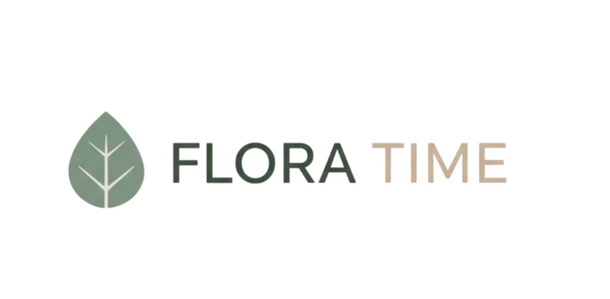

# Flora Time

## Introducción

Flora Time es una aplicación web de productividad. Su objetivo principal es ayudar a los usuarios a mejorar su concentración y reducir el estrés laboral mediante la creación de un entorno tranquilo.

Flora Time combina tres funciones fundamentales:
1.  **Técnica Pomodoro:** Intervalos de trabajo y descanso para mantener la mente fresca.
2.  **Sonidos Ambientales:** Audios tranquilos (lluvia, bosque, fuego, café) para aislar el ruido externo.
3.  **Growth Tracker:** Un sistema de recompensa donde el progreso del usuario se visualiza mediante el crecimiento de un árbol virtual.

## Tecnologías utilizadas

Este proyecto fue desarrollado como proyecto final para el curso **COMP2051: Web Development Client-Side (Front-End)**
